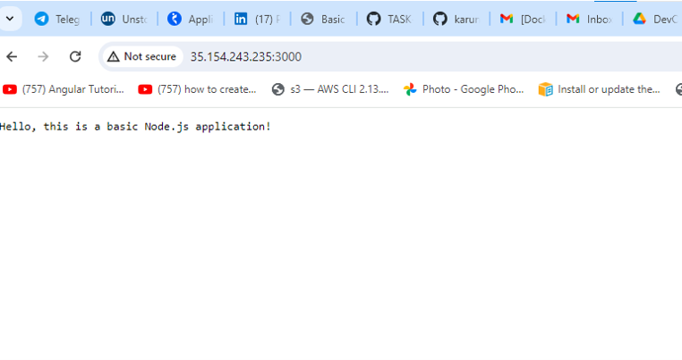

# interncarrier_task1
# Title:
# Setup Continuous Integration/Continuous Deployment (CI/CD) Pipeline
# Introduction
  Create a CI/CD pipeline to automate the build, test, and deployment processes for a web application using Jenkins, Docker, and GitHub/GitLab.
  
  
# steps